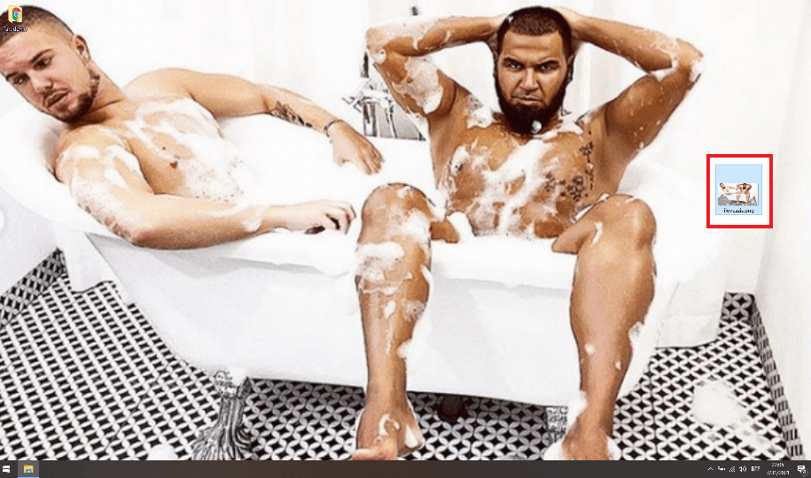

# PT_ConsoleApp_WorkStationLocker

WorkStationLocker is a simple console application that locks my office laptop automatically every time I get away from the desk.

## General Information

At the time of writing I have spent 6 months in Bede Gaming Ltd. Unfortunatelly, during this period I have left my laptop unlocked twice.  
In my first week I got 'punished' by getting 'Hasselhoffed'. 6 months later, during my probation interview - I got 'Azissed' too (see images).
In other words, once I got back from the toilet or the conference room I found my wallpaper updated with pictures of mens' bodies, barely dressed...

So I was left with no choice but to to defend myself! So here are the steps to a secure office well-being:

1. An analogous ultrasonic sensor (HC-SR04) is installed onto my desk.
2. The sensor is connected to a Raspberry Pi Zero W.
3. Once booted, the Pi runs a simple Python script, which checks the distance in front of the sensor within a loop.
4. In case the distance is > 150 cm (ergo I moved away from the desk) => a message with header 'Lock' is sent to an email of mine.
5. In parallel, the laptop runs a console app which is constantly checking the inbox for 'Lock' emails received in the last seconds.
6. If such email was received, it executes a "LockWorkStation" command through the cmd.exe which locks the laptop 'automatically'.

~ HAPPY END ~

## Technologies

- using OpenPop.Mime;
- using OpenPop.Pop3;
- using System.Net.Mail;

## Contents

### src
- WorkStationLocker.sln
- WorkStationLocker.ConsoleApp // to be executed on the office laptop
- WorkStationLOcker.PythonApp // to be executed on the Raspberry Pi

### res
- scrot // screenshots of the traumatized desktop of mine
  - hasselhoff_wallpaper.jpg
  - azis_wallpaper.jpg
- icons

## ~ THE END ~
